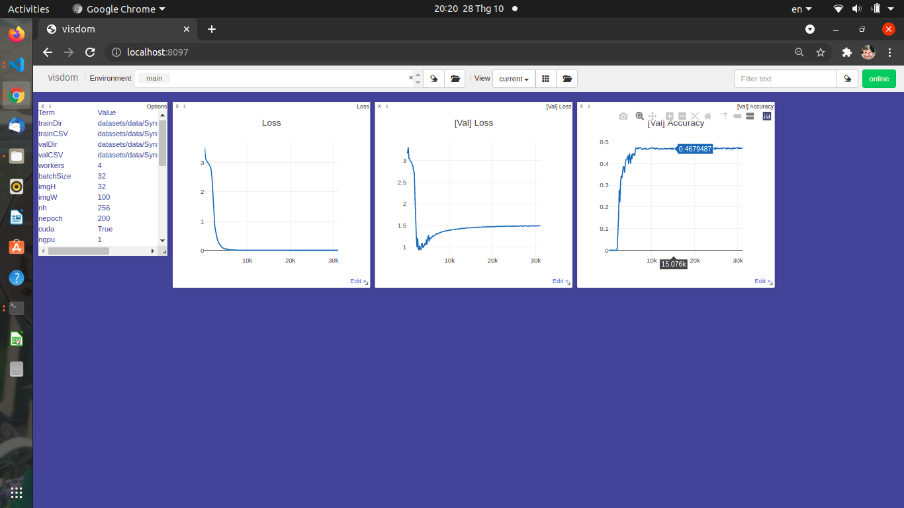

Convolutional Recurrent Neural Network
========================================

This implements the Convolutional Recurrent Neural Network (CRNN) in pytorch, original [paper](https://arxiv.org/abs/1507.05717).
This source has just several change from [this](https://github.com/meijieru/crnn.pytorch).
Origin software could be found in [crnn](https://github.com/bgshih/crnn)

Run demo
--------
A demo program can be found in ``demo.py``. Before running the demo, download the pretrained mode 
from [Dropbox](https://www.dropbox.com/s/0u7qbijviuztoo1/CRNN_Synth.pth?dl=0).
This pretrained model give ~94% accuracy on Synth dataset.
Put the downloaded model file ``crnn.pth`` into directory ``data/``. Then launch the demo by:

    python demo.py
  
The demo reads an example image and recognizes its text content.

Example image:


Expected output:
    loading pretrained model from ./datasets/crnn.pth
    c---o--l-o--r-bb-liinn-d-- => colorblind
    
Performance
-----------
A performance with very small synth dataset (~400mb) with no augmentation, train from scratch

This is an acceptable result

Create dataset
--------------
Currently ``create_dataset.py`` has just prepared for creating dataset from .txt file
```python
create_from_txt(data_dir='path to images file',
                  data_txt='path to .txt file',
                  outputPath='output path for created data',
                  valSplit=.2)  # train val ratio
```
Explore ```create_dataset.py``` for more details.

Visualize (optional)
--------------------
Start visdom sever for visualization. Please remove '--enable_vis' if visualization is not needed.

    # Run visdom server on port 8074
    visdom -port 8097

Train a new model
-----------------
Execute ``python train.py --adadelta --trainDir {train_image_path} --valDir {val_image_path} --trainCSV {train_csv_file} --valCSV {val_csv_file} --cuda --enable-vis``. 
Explore ``train.py`` for details.
